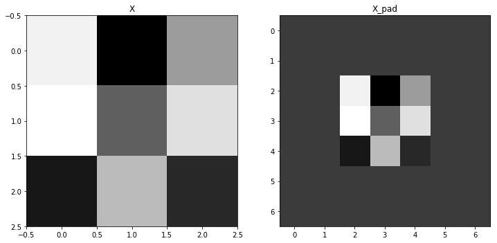

# Convolutional Neural Networks: Step by Step(1)

　　　　Section(1):基于numpy来实现CNN中的CONV和POOL操作，包含forward propagation 和 backward propagation,
Reference : Andrew NG的DeepLearning　course,section 4, week1.

# **符号记法**:

- 上标 \( [l] \) 表示该层在CNN中的位置 \(l^{th}\) layer.

    - 例如: \(a^{[4]}\) 表示 \(4^{th}\) layer 激活输出. \(W^{[5]}\) 和 \(b^{[5]}\) 是 \(5^{th}\) layer 参数（卷积核/滤波器和偏置).


- 上标 \((i)\) 表示第 \(i^{th}\) example. 

    - 例如: \(x^{(i)}\) ：\(i^{th}\) 训练样本.
    
    
- 下标 \(i\) 表示 \(i^{th}\) entry of a vector.

    - 例如: \(a^{[l]}_i\) 表示 \(l^{th}\) layer 的第 \(i^{th}\) entry of the activations(假设这是一个full connected layer)
    
- \(n_H, n_W 和 n_C\) 分别表示网络中每一层张量(tensor)的，高，宽和通道的数量(深度).加上上标 \(l\),记为 \(n_H^{[l]}\), \(n_W^{[l]}\), \(n_C^{[l]}\)，表示 \(l^{th}\) layer tensor的大小

- \(n_{H_{prev}}\), \(n_{W_{prev}}\) 和 \(n_{C_{prev}}\) 分别表示previous layer中的张量的大小(即：输入tensor的高和宽.　\(l^{th}\) layer 的 previous layer记为： \(n_H^{[l-1]}\), \(n_W^{[l-1]}\), \(n_C^{[l-1]}\). 


## 1 - Packages


```python
 
import numpy as np
import h5py
import matplotlib.pyplot as plt

%matplotlib inline
plt.rcParams['figure.figsize'] = (10, 6) # set default size of plots
plt.rcParams['image.interpolation'] = 'nearest'
plt.rcParams['image.cmap'] = 'gray'

np.random.seed(1)
 
```

## 2 - Outline 

　接下来通过Python和Numpy来实现卷积神经网络中的关键模块，卷积和池化，下面是主要步骤：
 （非常细节)

- <font size = 5 color = 'orange'>Convolution functions</font> :

    - Zero Padding
    - Convolve window 
    - Convolution forward
    - <font color = 'red'>Convolution backward</font>
    
- <font size = 5 color = 'orange'>Pooling functions</font> :

    - Pooling forward
    - Create mask 
    - Distribute value
    - <font color = 'red'>Pooling backward</font>
    
 

**Note**：

<font size=4 color = 'red'>　　在forward propagation 中一些中间计算结果变量或参数需要保存，因为在反向传播中需要用到这些中间计算结果计算出梯度</font>

## 3 - Convolutional Neural Networks

　　现在市面上已经有很多DL框架了，比如Tensorflow,Keras,Caffe,Mxnet等等，用起来非常方便，但是不利用进一步的理解卷积网络实现过程中的更多细节．通过一步步的来实现CNN有助于加深对概念的理解．原始的tensor在经过卷积层处理之后的大小和深度一般会发生变化，如下图所示：


 
### 3.1 - Zero-Padding

<font color='orange'>Zero-padding</font>:在原始图像的周围进行0想素值填充．

 <caption><center> **Zero-Padding**<br> Image (3 channels, RGB)填充像素宽度为２. </center></caption>

**Zero_Padding的好处**:

- 每一次卷积操作后，原始的图像就会缩小，在更深的网络中，可能在多次卷积之后，原始图像的大小只剩下１ｘ１大小了，为了避免这样．在每次卷积前先对图像的边缘进行填充`padding = 'SAME'`，卷积后的图像大小和卷积前相同．

- Zero_Padding 还可以帮助我们保留更多关于图像的信息．如果不进行填充，那些在图像角落和边缘部分的像素值在卷积输出过程中采用次数较少，这会丢掉图像很多的边缘位置信息．


<br>接下来通过np.pad来实现 zero_pad( )这个辅助函数．[Use np.pad](https://docs.scipy.org/doc/numpy/reference/generated/numpy.pad.html).

- 举个例子：如果你要对数组 "a" of shape \((5,5,5,5,5)\)进行填充，在第二个维度上进行宽度为１个像素的填充(`pad = 1`),在第三个维度上进行宽度为３填充(`pad = 3`)，在其余的维度上不进行填充(`pad = 0`),`np.pad()`的用法如下所示：

- constant_values = (0):填充的像素值，可以是任何不超过255的int

```python
a = np.pad(a, ((0,0), (1,1), (0,0), (3,3), (0,0)), 'constant', constant_values = (..,..))
```


```python
# FUNCTION: zero_pad

def zero_pad(X, pad):
    
    """
    X : input image(array)
    Argument:
    X -- array of shape (m, n_H, n_W, n_C)，m : batch of m images
    pad -- integer
    Returns:
    X_pad -- padded image of shape (m, n_H + 2*pad, n_W + 2*pad, n_C)
    """
    
    X_pad = np.pad(X, ((0, 0),(pad, pad),(pad, pad),(0, 0)), 'constant', constant_values=0)

    return X_pad
```


```python
# Zero_padding 
np.random.seed(1)
x = np.random.randn(4, 3, 3, 2)
x_pad = zero_pad(x, 2)
print ("x.shape =", x.shape)
print ("x_pad.shape =", x_pad.shape)
print ("x[1,1] =", x[1,1])
print ("x_pad[1,1] =", x_pad[1,1])

# visualization Zero_padding result
plt.figure(figsize=(12, 6))
for i, img, title in zip(range(2),[x, x_pad],['X','X_pad']):
    ax = plt.subplot(1, 2, i+1)
    ax.set_title(title)
    ax.imshow(img[0,:,:,0])
 
```

    x.shape = (4, 3, 3, 2)
    x_pad.shape = (4, 7, 7, 2)
    x[1,1] = [[ 0.90085595 -0.68372786]
     [-0.12289023 -0.93576943]
     [-0.26788808  0.53035547]]
    x_pad[1,1] = [[ 0.  0.]
     [ 0.  0.]
     [ 0.  0.]
     [ 0.  0.]
     [ 0.  0.]
     [ 0.  0.]
     [ 0.  0.]]





### RGB,image zero_padding


```python
# very beautiful, input iagme
image = plt.imread('images/pic2.jpg')
# image shape:(366, 310, 3)
# image_pad shape:(426, 370, 3)
image_pad = np.pad(image, ((30,30),(30,30),(0,0)), 'constant', constant_values=50)

# visualization image padding result
fig, axarr = plt.subplots(1, 2)
axarr[0].set_title('image')
axarr[0].imshow(image)
axarr[1].set_title('image_pad')
axarr[1].imshow(image_pad)
```

)


### 3.2 - Single step of convolution 

　　实现Zero_padding功能后，接下来就是卷积了，我们先实现一个单步的卷积操作，然后在将其应用在整个输入图像上，卷积的完整过程如下图所示：

 
<caption><center><font color='purple'> **Convolution operation**<br>filter：３x３，stride =1 (stride:filter卷积过程中滑动的步长)</font> </center></caption>

　　在计算机视觉的应用中，上图中左边的矩阵代表输入的原始图像，矩阵中的每个元素来自图像中对应位置的像素值，卷积核(滤波器)从图像的角落(边缘)位置开始,与覆盖的矩阵元素相乘后在求和，这样就得到了卷积的输出,完成了单个卷积操作．接下来根据stride参数，继续在原始图像上滑动，相乘求和，如此这般．直到遍历了原始输入图像的全部像素就完成了一次卷积过程．得到一个新的矩阵(见上图右边).
  
<font size=4 color='purple'>conv_single_step()</font>. [Hint](https://docs.scipy.org/doc/numpy-1.13.0/reference/generated/numpy.sum.html).


```python
# FUNCTION: conv_single_step

def conv_single_step(a_slice_prev, W, b):
    """
    Arguments:
    a_slice_prev -- slice of input data of shape (f, f, n_C_prev),not full input matrix
    W -- Weight parameters - matrix of shape (f, f, n_C_prev)
    b -- Bias parameters - matrix of shape (1, 1, 1)
    Returns:
    Z -- result of convolving the sliding window (W, b) on a slice x of the input data
    a scalar value
    """
    # Element-wise product between a_slice and W. Add bias.
    s = np.multiply(a_slice_prev, W) + b
    # Sum over all entries of the volume s
    Z = np.sum(s)

    return Z
```


### 3.3 - Convolutional Neural Networks - Forward pass

　　在Single step of convolution的基础之上，接下来实现一个完整的卷积过程：即卷积核(滤波器)会移动地覆盖整个输入图像的每一个像素，然后得到一个新的矩阵．

　

**Hint**: 
1. 单步的卷积：指的是对输入图像的局部区域(滤波器覆盖的区域)进行卷积操作,所以每次的单步卷积，要扣出输入图像的局部区域．举个例子：

   - 矩阵"a_prev"代表一个输入的tensor (shape (5,5,3)),滤波器的大小为２x２,a_prev对应的切片如下所示:

   ```python
    a_slice_prev = a_prev[0:2,0:2,:]
  ```
    上面的切片`a_slice_prev`位于输入图像的左上角位置，也是卷积的起始位置
    
２.每完成一次单步的卷积操作，都要对`a_slice_prev`表示的区域进行更新，我们通过定义这四个变量`vert_start`, `vert_end`, `horiz_start` 和 `horiz_end`.来确定卷积区域的位置，如下图所示：

 
<caption><center><font color='purple'>**Definition of a slice using vertical and horizontal start/end (with a 2x2 filter)** <br> This figure shows only a single channel. </font> </center></caption>


**Reminder**:

下面是计算卷积后输出tensor尺寸的公式:\(\lfloor \frac{a}{b} \rfloor\)向下取整
###$$ n_H = \lfloor \frac{n_{H_{prev}} - f + 2 \times pad}{stride} \rfloor +1 $$
###$$ n_W = \lfloor \frac{n_{W_{prev}} - f + 2 \times pad}{stride} \rfloor +1 $$
###$$ n_C = \text{number of filters}$$

接下来．开始实现完整的卷积过程，暂时先不考虑向量化，通过for-loop来实现．


```python
# GRADED FUNCTION: conv_forward

def conv_forward(A_prev, W, b, hparameters):
    """
    forward propagation for a convolution function
    b -- Biases, numpy array of shape (1, 1, 1, n_C)
    Returns:
    Z -- conv output, numpy array of shape (m, n_H, n_W, n_C)
    cache -- cache of values needed for the conv_backward() function
    """
    
    # A_prev's shape, A_prev : output of previous layer
    (m, n_H_prev, n_W_prev, n_C_prev) = A_prev.shape
    
    # W's shape, W : Weights(filter)
    # n_C : numbers of filters
    (f, f, n_C_prev, n_C) = W.shape
    
    # hparameters : python dictionary containing 'stride' and 'pad'
    stride = hparameters['stride']
    pad = hparameters['pad']
    
    # Compute the dimensions of the CONV output volume 
    # Hint: use int() to floor.
    n_H = 1 + int((n_H_prev + 2 * pad - f) / stride)
    n_W = 1 + int((n_W_prev + 2 * pad - f) / stride)
    
    # Initialize the output volume Z with zeros.
    Z = np.zeros((m, n_H, n_W, n_C))
    
    # Create A_prev_pad by padding A_prev
    A_prev_pad = zero_pad(A_prev, pad)
    
    for i in range(m):                          # loop over the batch of training examples
        a_prev_pad = A_prev_pad[i]              # Select ith training example's padded 
        for h in range(n_H):                    # loop over vertical axis of the output 
            for w in range(n_W):                # loop over horizontal axis of the output 
                for c in range(n_C):            # loop over channels (n_C) of the output
                    
                    # Find the the current "slice" 
                    vert_start = h * stride
                    vert_end = vert_start + f
                    horiz_start = w * stride
                    horiz_end = horiz_start + f
                    
                    # silce up (3D) slice of a_prev_pad
                    a_slice_prev = a_prev_pad[vert_start:vert_end, horiz_start:horiz_end, :]
                    # Convolve (3D) slice with the correct filter W and bias b, to get back one output 
                    Z[i, h, w, c] = np.sum(np.multiply(a_slice_prev, W[:, :, :, c]) + b[:, :, :, c])
                                        
    # check your output shape is correct
    assert(Z.shape == (m, n_H, n_W, n_C))
    
    # Save information in "cache" for the backprop
    cache = (A_prev, W, b, hparameters)
    
    return Z, cache
```

### Filter
```python
# W : two filter, 垂直＆水平边缘检测,边缘检测，n_C = 3
W = np.array([
    [
        [[1., 1., -1.], [1.,  1., -1.], [1., 1., -1]],
        [[1., 0., -1.], [1.,  0., -1.], [1., 0., -1]],
        [[1.,-1., -1.], [1., -1., -1.], [1.,-1., -1]]
    ],
    [
        [[0., 1., -1.], [0.,  1., -1.], [0., 1., -1]],
        [[0., 0.,  8.], [0.,  0.,  8.], [0., 0.,  8]],
        [[0.,-1., -1.], [0., -1., -1.], [0.,-1., -1]]
    ],
    [
        [[-1., 1., -1], [-1.,  1.,-1.], [-1., 1.,-1]],
        [[-1., 0., -1], [-1.,  0.,-1.], [-1., 0.,-1]],
        [[-1.,-1., -1], [-1., -1.,-1.], [-1.,-1.,-1]]
    ]
])

# bias

b = np.random.randn(1,1,1,3)

# hparameters:A python dictionary
hparameters = {"pad" : 1,"stride": 1}

# image转换为４维tensor
image = image.reshape(1, 366, 310, 3)

# vonvolution 
# 得到一个通道为２的图像，分别对应垂直和水平边缘检测的结果
image_conv, cache_conv = conv_forward(image, W, b, hparameters)
```

### Visualization Convolution Result


```python
plt.rcParams['figure.figsize'] = (15, 5)
fig, axarr = plt.subplots(1, 5)
# Original image
axarr[0].set_title('image')
axarr[0].imshow(image[0])
# Vertical Edge Detection
axarr[1].set_title('Vertical')
axarr[1].imshow(image_conv[0][:,:,0])
# Horizontal Edge Detection
axarr[2].set_title('Horizontal')
axarr[2].imshow(image_conv[0][:,:,1])
# Edge Detection
axarr[3].set_title('Edge Detection')
axarr[3].imshow(image_conv[0][:,:,2])
# 三组卷积结果的叠加显示
axarr[4].set_title('image_conv')
axarr[4].imshow(image_conv[0])
```

   


 )


　　现在卷积的功能已经基本完成了，只剩下一个非线性的激活函数．对卷积后的结果进行一个非线性的变换．

```python
# Convolve the window to get back one output 
Z[i, h, w, c] = ...
# Apply activation
A[i, h, w, c] = activation(Z[i, h, w, c])
```
activation function随后添加，接下来是池化Pooling layer


## 4 - Pooling layer 

Pooling layer池化层常用来缩减模型的大小，同时可以减小模型的计算量和提高提取特征的鲁棒性．
池化分为两种：

- Max-pooling layer(最大池化):
　

- Average-pooling layer(平均池化):

　
　
　　池化层仅对输入volume的n_h,n_w两个维度进行缩减，并不改变输入volume的深度(通道数),在池化过程中没有需要学习的参数，只需要手动设置连个超参数：window size(filter size): \(f\)和 stirdes:　\(s\)．这两个参数直接影响到池化后输入volume的高和宽．

### 4.1 - Forward Pooling
接下来，实现 MAX-POOL and AVG-POOL 

**Reminder**:
　
<font size=4 color='orange'>不进行０填充的情况下，池化后tensor大小的计算公式．（tensor/volume)</font>
###$$ n_H = \lfloor \frac{n_{H_{prev}} - f}{stride} \rfloor +1 $$
###$$ n_W = \lfloor \frac{n_{W_{prev}} - f}{stride} \rfloor +1 $$
###$$ n_C = n_{C_{prev}}$$


```python
# FUNCTION: pool_forward

def pool_forward(A_prev, hparameters, mode = "max"):
    """
    forward pass of the pooling layer
    mode -- string ("max" or "avg")
    
    Returns:
    A -- output of the pool layer,shape (m, n_H, n_W, n_C)
    cache -- cache used in the backward pass of the pooling layer
    contains the input and hparameters 
    """
    
    # dimensions of the input shape
    (m, n_H_prev, n_W_prev, n_C_prev) = A_prev.shape
    
    # hyperparameters from "hparameters"
    f = hparameters["f"]
    stride = hparameters["stride"]
    
    # the dimensions of the output
    n_H = int(1 + (n_H_prev - f) / stride)
    n_W = int(1 + (n_W_prev - f) / stride)
    n_C = n_C_prev
    
    # Initialize output result matrix A
    A = np.zeros((m, n_H, n_W, n_C)) 
    
    for i in range(m):                   # loop over the training examples
        for h in range(n_H):             # loop on the vertical axis of the output volume
            for w in range(n_W):         # loop on the horizontal axis of the output volume
                for c in range (n_C):    # loop over the channels of the output volume
                    
                    # Find the current "slice"(the window)
                    vert_start = h * stride
                    vert_end = vert_start + f
                    horiz_start = w * stride
                    horiz_end = horiz_start + f
                    
                # silce up the slice(window) on the ith training example of A_prev,channel
                    a_prev_slice = A_prev[i, vert_start:vert_end, horiz_start:horiz_end, c]
                    
                    # Compute the pooling operation on the slice.
                    if mode == "max":
                        A[i, h, w, c] = np.max(a_prev_slice)
                    elif mode == "avg":
                        A[i, h, w, c] = np.mean(a_prev_slice)
    
    # Store the input and hparameters for pool_backward()
    cache = (A_prev, hparameters)
    
    # check your output shape is correct
    assert(A.shape == (m, n_H, n_W, n_C))
    
    return A, cache
```


```python
# hparameters
hparameters = {'f':5, 'stride':3}
image_maxpool,cache_max = pool_forward(image, hparameters, mode='max')
image_avgpool,cache_avg = pool_forward(image, hparameters, mode='avg')
```

## Visualization Pooling Result


```python
plt.rcParams['figure.figsize'] = (16, 10)
# Max Pooling, f:3x3, s:1
fig, ax = plt.subplots(2, 4)
for row_idx,img,mode in zip([0,1],[image_maxpool, image_avgpool],['Max','Average']):
    for col_idx, channel_idx, title in zip(range(4),[0,0,1,2],['Original','Channel R',
                                                         'Channel G','Channel B']):
        ax[row_idx, col_idx].set_title(mode+title)
        if col_idx == 0:
            ax[row_idx, col_idx].imshow(image[channel_idx])
        else: ax[row_idx, col_idx].imshow(img[0][:,:,channel_idx])
```


　　现在已经实现了CNN中的两个核心组件，conv_layer和pool_layer.下面是Convolutional neural networks中的Backpropagations 部分．

## 5 - Backpropagation in convolutional neural networks 
 
　　如今市面上的深度学习框架，可以非常方便的实现一个卷积神经网络，作为一个深度学习工程师，并不需要太多关注CNN中反向传播的具体细节，因为深度学习框架可以自动实现这些过程．卷积神经网络中的反向传播要比全连接神经网络还要复杂的多．
　　如果你想要了解在CNN中反向传播的更多细节，接着往下看．在FCNN中，我们是通过每次迭代后的cost Function来计算梯度，更新参数．同样的，在CNN中反向传播的过程是类似的．

### 5.1 - Convolutional layer backward pass 

　　**首先是CONV_layer的反向传播过程．**

#### 5.1.1 - Computing dA:

####$$ dA += \sum _{h=0} ^{n_H} \sum_{w=0} ^{n_W} W_c \times dZ_{hw} \tag{1}$$

 
注意，在每一次的累加过程中，是用同一个滤波器(filter)\(W_c\)乘以 \(dZ_{h,w}\) 更新 \(dA\).  

```python
da_prev_pad[vert_start:vert_end, horiz_start:horiz_end, :] += W[:,:,:,c] * dZ[i, h, w, c]
```

#### 5.1.2 - Computing dW:


####$$ dW_c  += \sum _{h=0} ^{n_H} \sum_{w=0} ^ {n_W} a_{slice} \times dZ_{hw}  \tag{2}$$

\(a_{slice}\) :the slice which was used to generate the acitivation \(Z_{ij}\).  

```python
dW[:,:,:,c] += a_slice * dZ[i, h, w, c]
```

#### 5.1.3 - Computing db:


####$$ db = \sum_h \sum_w dZ_{hw} \tag{3}$$

```python
db[:,:,:,c] += dZ[i, h, w, c]
```
接下来实现`conv_backward` function


```python
def conv_backward(dZ, cache):
    """
    backward propagation for a convolution function
    Arguments:
    dZ -- gradient of the cost with respect to the output of the conv layer (Z),
    　　　　numpy array of shape (m, n_H, n_W, n_C)
    cache -- cache = (A_prev, W, b, hparameters), output of conv_forward()
    　　　　
    Returns:
    dA_prev -- gradient of the cost with the input of the conv layer (A_prev),
               numpy array of shape (m, n_H_prev, n_W_prev, n_C_prev)
    dW -- gradient of the cost with respect to the weights of the conv layer (W)
          numpy array of shape (f, f, n_C_prev, n_C)
    db -- gradient of the cost with respect to the biases of the conv layer (b)
          numpy array of shape (1, 1, 1, n_C)
    """
    # Retrieve information from "cache"
    (A_prev, W, b, hparameters) = cache
    
    # Retrieve dimensions from A_prev's shape
    (m, n_H_prev, n_W_prev, n_C_prev) = A_prev.shape
    
    # Retrieve dimensions from W's shape
    (f, f, n_C_prev, n_C) = W.shape
    
    # Retrieve information from "hparameters"
    stride = hparameters['stride']
    pad = hparameters['pad']
    
    # Retrieve dimensions from dZ's shape
    (m, n_H, n_W, n_C) = dZ.shape
    
    # Initialize dA_prev, dW, db with the correct shapes
    dA_prev = np.zeros((m, n_H_prev, n_W_prev, n_C_prev))                           
    dW = np.zeros((f, f, n_C_prev, n_C))
    db = np.zeros((1, 1, 1, n_C))

    # Pad A_prev and dA_prev
    A_prev_pad = zero_pad(A_prev, pad)
    dA_prev_pad = zero_pad(dA_prev, pad)
    
    for i in range(m):                       # loop over the training examples
        
        # select ith training example from A_prev_pad and dA_prev_pad
        a_prev_pad = A_prev_pad[i]
        da_prev_pad = dA_prev_pad[i]
        
        for h in range(n_H):                   # loop over vertical axis of the output volume
            for w in range(n_W):               # loop over horizontal axis of the output volume
                for c in range(n_C):           # loop over the channels of the output volume
                    
                    # Find the corners of the current "slice"
                    vert_start = h * stride
                    vert_end = vert_start + f
                    horiz_start = w * stride
                    horiz_end = horiz_start + f
                    
                    # Use the corners to define the slice from a_prev_pad
                    a_slice = a_prev_pad[vert_start:vert_end, horiz_start:horiz_end, :]

                    # Update gradients for the window and the filter's parameters using the code formulas given above
                    da_prev_pad[vert_start:vert_end, horiz_start:horiz_end, :] += W[:,:,:,c] * dZ[i, h, w, c]
                    dW[:,:,:,c] += a_slice * dZ[i, h, w, c]
                    db[:,:,:,c] += dZ[i, h, w, c]
                    
        # Set the ith training example's dA_prev to the unpaded da_prev_pad (Hint: use X[pad:-pad, pad:-pad, :])
        dA_prev[i, :, :, :] = dA_prev_pad[i, pad:-pad, pad:-pad, :]
    
    return dA_prev, dW, db
```

## 5.2 Pooling layer - backward pass

- Max pooling backward pass
- average pooling backward pass

### 5.2.1 Max pooling - backward pass  

 开始pooling backward之前，还需要实现一些辅助函数
 (helper function)`create_mask_from_window()`,下面是它在最大池化中的作用：

####$$ X = \begin{bmatrix}
1 && 3 \\
4 && 2
\end{bmatrix} \quad \rightarrow  \quad M =\begin{bmatrix}
0 && 0 \\
1 && 0
\end{bmatrix}\tag{4}$$
　

　　正如上面的两个矩阵所示，\(X\) 是　\(A_prev\)　的一个slice,最大池化后，只保留slice中最大的元素输出即：４，
　　 \(M\) :`mask`矩阵，与\(X\)小相同，用来标记$X$中最大元素的位置．在与$X$中最大元素相同位置标记为１，其他元素为０．　

create_mask_from_window()，Python实现
```
mask = (X == np.max(X))
```


```python
def create_mask_from_window(x):
    """
    Creates a mask from an input matrix x,x : a slice of the A_prev
    Arguments:
    x -- Array of shape (f, f)
    
    Returns:
    mask -- Array of the same shape as window/x/(f,f)
    """
    mask = (x == np.max(x))
    
    return mask
```

## Mask Matrix
　　Why do we keep track of the position of the max? It's because this is the input value that ultimately influenced the output, and therefore the cost. Backprop is computing gradients with respect to the cost, so anything that influences the ultimate cost should have a non-zero gradient. So, backprop will "propagate" the gradient back to this particular input value that had influenced the cost. 

大意就是：这个位置(max value)的输入，会影响到输出，和最终的Cost.反向传播过程中梯度是根据Cost来计算的．所以在forward pass中，但凡是会影响到cost的输入(particular input),在反向传播过程中都会传递梯度给这些(particular input)

### 5.2.2 - Average pooling - backward pass 

　　在对大池化当中，每个输入窗口(input window/a slice of A_prev)中，最终的输出是窗口中最大的元素，其他的元素对输出和最终Cost中的贡献为０，但是在平均池化当中，在输入窗口中所有元素的贡献权重是相同的．所以在反向传播过程中，平均池化的输入窗口中元素，都有一个非零的梯度．因此，和最大池化一样，同样需要一个辅助函数`distribute_vlaue`，计算窗口中元素的梯度．

举个例子：

## Average pooling : 

- forward propagation : 
####$$ X = \begin{bmatrix} 1 && 2 \\ 3 && 4 \end{bmatrix} \quad \rightarrow  \quad Z= 2.5\tag{5.1}$$
- backward propagation :
####$$ dZ = 1 \quad \rightarrow  \quad dZ =\begin{bmatrix}
1/4 && 1/4 \\
1/4 && 1/4
\end{bmatrix}\tag{5.2}$$

(5.1,5.2)已经非常清楚了．[Hint](https://docs.scipy.org/doc/numpy-1.13.0/reference/generated/numpy.ones.html)


```python
def distribute_value(dz, shape):
    """
    Arguments:
    dz -- input scalar
    shape -- the shape (n_H, n_W) of the output matrix 
             for which we want to distribute the value of dz
    
    Returns:
    a -- Array of size (n_H, n_W) for which we distributed the value of dz
    """
    # shape of the filter(input window)
    (n_H, n_W) = shape
    # Compute the value to distribute on the matrix 
    average = dz / (n_H * n_W)
    # Create a matrix where every entry is the "average" value 
    a = np.ones(shape) * average
    
    return a
```

### 5.2.3 Putting it together: Pooling backward 


```python
def pool_backward(dA, cache, mode = "max"):
    """
    Implements the backward pass of the pooling layer
    
    Arguments:
    dA -- gradient of cost with respect to the output of the pooling layer, same shape as A
    cache -- cache output from the pooling layer, contains the layer's input，hparameters 
    mode -- the pooling mode you would like to use, ("max" or "avg")
    
    Returns:
    dA_prev -- gradient of cost with respect to the input of the pooling layer, 
    same shape as A_prev
    """
    # Retrieve information from cache 
    (A_prev, hparameters) = cache
    
    # Retrieve hyperparameters from "hparameters" 
    stride = hparameters['stride']
    f = hparameters['f']
    
    # Retrieve dimensions from A_prev's shape and dA's shape 
    m, n_H_prev, n_W_prev, n_C_prev = A_prev.shape
    m, n_H, n_W, n_C = dA.shape
    
    # Initialize dA_prev with zeros 
    dA_prev = np.zeros_like(A_prev)
    
    for i in range(m):                       # loop over the training examples
        
        # select training example from A_prev 
        a_prev = A_prev[i]
        for h in range(n_H):                   # loop on the vertical axis
            for w in range(n_W):               # loop on the horizontal axis
                for c in range(n_C):           # loop over the channels (depth)
                    
                    # Find the corners of the current "slice"
                    vert_start = h * stride
                    vert_end = vert_start + f
                    horiz_start = w * stride
                    horiz_end = horiz_start + f
                    
                    # Compute the backward propagation in both modes.
                    if mode == "max":
                        
                        # Use the corners and "c" to define the current slice from a_prev 
                        a_prev_slice = a_prev[vert_start:vert_end, horiz_start:horiz_end, c]
                        # Create the mask from a_prev_slice 
                        mask = create_mask_from_window(a_prev_slice)
                        # Set dA_prev to be dA_prev + (the mask multiplied by the correct entry of dA)
                        dA_prev[i, vert_start: vert_end, horiz_start: horiz_end, c] += mask * dA[i, vert_start, horiz_start, c]
                        
                    elif mode == "avg":
                        
                        # Get the value a from dA
                        da = dA[i, vert_start, horiz_start, c]
                        # shape of the filter as fxf 
                        shape = (f, f)
                        # Distribute it to get the correct slice of dA_prev. i.e. Add the distributed value of da
                        dA_prev[i, vert_start: vert_end, horiz_start: horiz_end, c] += distribute_value(da, shape)
    
    return dA_prev
```


```python
np.random.seed(1)
A_prev = np.random.randn(5, 5, 3, 2)
hparameters = {"stride" : 1, "f": 2}
A, cache = pool_forward(A_prev, hparameters)
dA = np.random.randn(5, 4, 2, 2)

dA_prev = pool_backward(dA, cache, mode = "max")
print("mode = max")
print('mean of dA = ', np.mean(dA))
print('dA_prev[1,1] = ', dA_prev[1,1])  
print()
dA_prev = pool_backward(dA, cache, mode = "avg")
print("mode = average")
print('mean of dA = ', np.mean(dA))
print('dA_prev[1,1] = ', dA_prev[1,1]) 
```

    mode = max
    mean of dA =  0.145713902729
    dA_prev[1,1] =  [[ 0.          0.        ]
     [ 5.05844394 -1.68282702]
     [ 0.          0.        ]]
    
    mode = average
    mean of dA =  0.145713902729
    dA_prev[1,1] =  [[ 0.08485462  0.2787552 ]
     [ 1.26461098 -0.25749373]
     [ 1.17975636 -0.53624893]]


　　CNN的主要组件已经完成了，接下来就一可以使用上面实现的功能，搭配FC神经网络来搭建CNN！
